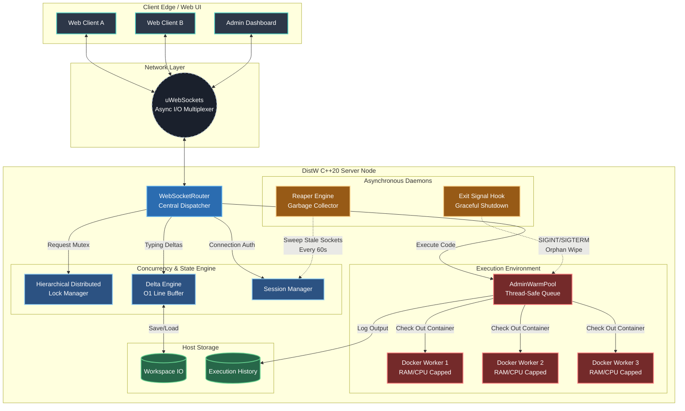

# DistW 
## High-Performance Distributed Collaborative IDE

DistW is a real-time, hybrid-edge collaborative Integrated Development Environment (IDE) built for low-latency synchronization and secure remote code execution. 

Engineered from the ground up with a **C++20 backend** and a **React/TypeScript frontend**, DistW solves the complexities of multi-user concurrency, network efficiency, and untrusted code sandboxing through custom-built systems like a Hierarchical Distributed Lock Manager and a pre-warmed Docker pool.

---

## Why DistW?
Building a collaborative code editor presents three massive engineering challenges:
1. **Edit Collisions:** When multiple developers edit the same file simultaneously, race conditions occur. Traditional solutions like CRDTs (Conflict-free Replicated Data Types) or OT (Operational Transformation) introduce massive memory bloat and computational overhead.
2. **Network Bottlenecks:** Sending entire file states over a WebSocket on every keystroke cripples bandwidth and causes synchronization latency. 
3. **Malicious Code Execution:** Allowing users to compile and run C++ code remotely exposes the host server to infinite loops, RAM exhaustion, and fork bombs.

## What it does:
DistW tackles these challenges by shifting the paradigm from optimistic concurrency to **pessimistic concurrency** and strict container orchestration:
* **Pessimistic Locking:** Instead of merging conflicting edits, DistW uses a Trie-based Hierarchical Lock Manager to grant granular, atomic write-locks on files. Only the lock owner can edit, mathematically guaranteeing zero merge conflicts.
* **O(1) Delta Engine:** Text is synchronized using a vectorized line-buffer architecture, broadcasting only the exact line changes rather than full payloads.
* **Hardened Sandbox:** User code is injected into pre-warmed Docker containers with strict CPU, Memory, and PID limits, achieving sub-300ms "cold start" execution times while keeping the host server 100% secure.

---

## What I learnt and applied on the go:
* **Systems Programming:** C++20, Multi-threading (jthreads, mutexes, atomics), POSIX Systems.
* **High-Performance Networking:** Asynchronous I/O multiplexing, TCP/WebSockets via `uWebSockets`.
* **Concurrency & Synchronization:** Custom lock managers, thread-safe queues, race-condition mitigation.
* **DevOps & Security:** Docker container orchestration, process sandboxing, resource capping (cgroups).
* **Frontend Engineering:** React, TypeScript, Zustand (State Management), Monaco Editor integration, XTerm.js (I mainly used AI generated future-proof code for frontend as this is something i do not specialise in)

---

## System Architecture & Intricacies

### Backend Components (C++20 Core)
* **[`HierarchicalLockTree` (HDLM)](https://github.com/QuietkidAniket/DistW/blob/main/include/HierarchicalLockTree.hpp):** A custom Trie-based prefix tree that enforces pessimistic concurrency[cite: 1]. It manages lock states at the file and folder levels, ensuring that a user cannot edit a file if someone else is actively working on it[cite: 1].
* **[`DeltaEngine`](https://github.com/QuietkidAniket/DistW/blob/main/include/DeltaEngine.hpp):** Powers bandwidth-efficient text synchronization[cite: 1]. It utilizes a vectorized line buffer to achieve amortized **O(1) line-level insertions** and manages a lock-aware "Echo Killer" to prevent network latency from overwriting the active typist's local buffer[cite: 1].
* **[`AdminWarmPool`](https://github.com/QuietkidAniket/DistW/blob/main/include/AdminWarmPool.hpp):** A thread-safe queue managing a pool of pre-booted Docker containers (`gcc:latest`)[cite: 1]. When a user runs code, the pool orchestrates isolated compilation and execution via `stdin/stdout` redirection[cite: 1].
* **[`ReaperEngine`](https://github.com/QuietkidAniket/DistW/blob/main/include/ReaperEngine.hpp) & [Shutdown Daemon](https://github.com/QuietkidAniket/DistW/blob/main/src/main.cpp):** Two distinct garbage collection mechanisms[cite: 1]. The Session Sweeper runs asynchronously to purge disconnected TCP sockets and free RAM, while the Exit Daemon traps OS signals (`SIGINT`/`SIGTERM`) to gracefully wipe orphaned Docker containers upon server shutdown[cite: 1].
* **[`WebSocketRouter`](https://github.com/QuietkidAniket/DistW/blob/main/include/WebSocketRouter.hpp):** The central nervous system built on `uWebSockets`, mapping raw network payloads to the corresponding backend engines[cite: 1].

### Frontend Components (React / TS)
* **[`EditorWorkspace`](https://github.com/QuietkidAniket/DistW/blob/main/distw-ui/src/components/EditorWorkspace.tsx):** Wraps the Microsoft Monaco Editor[cite: 1]. Integrates custom UI decorators for remote cursor tracking (Google Docs-style) and dynamically toggles read/write access based on WebSocket lock states[cite: 1].
* **[`ExecutionPanel`](https://github.com/QuietkidAniket/DistW/blob/main/distw-ui/src/components/ExecutionPanel.tsx):** A resizable sidebar integrating `xterm.js` for authentic Unix terminal streaming, complete with a dual-pane Standard Input (`input.in`) and Standard Output (`stdout`) architecture[cite: 1].
* **[`AdminDashboard`](https://github.com/QuietkidAniket/DistW/blob/main/distw-ui/src/components/AdminDashboard.tsx):** A real-time telemetry overlay that polls the C++ server. It provides visual insights into Docker pool capacity, active distributed locks, and grants administrators the ability to remotely reboot containers or forcefully evict locked files.

### Architecture Diagram



---

## Getting Started

### Prerequisites
* macOS / Linux environment
* CMake & Clang/GCC (C++20 support)
* Docker Desktop (running)
* Node.js v18+ & npm

### Booting the C++ Edge Server
```bash
# Pull the execution image for the sandbox pool
docker pull gcc:latest

# Build and run the server
mkdir build && cd build
cmake ..
cmake --build .
./DistWServer
```

### Booting the Frontend UI (React / TypeScript)
The client-side application is isolated within the `distw-ui` directory. It uses Vite for lightning-fast Hot Module Replacement (HMR).

**1. Navigate to the frontend directory:**
```bash
cd distw-ui

```

**2. Install the necessary Node dependencies:**

```bash
npm install

```

**3. Start the Vite development server:**

```bash
npm run dev

```

> **Note:** The Vite server will typically start on `http://localhost:5173`. Ensure the C++ edge server is already running on port `9001` so the WebSocket connection can be established immediately upon loading the page.


